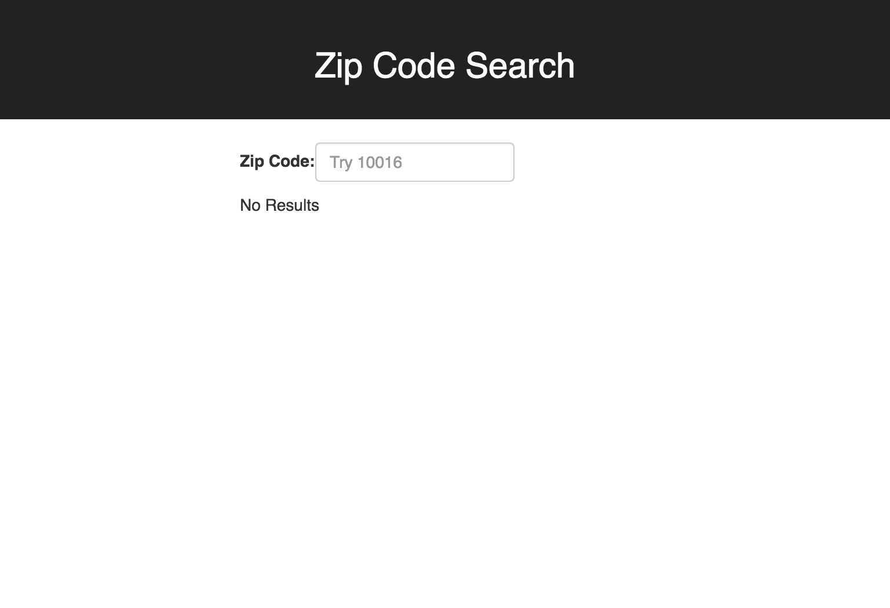
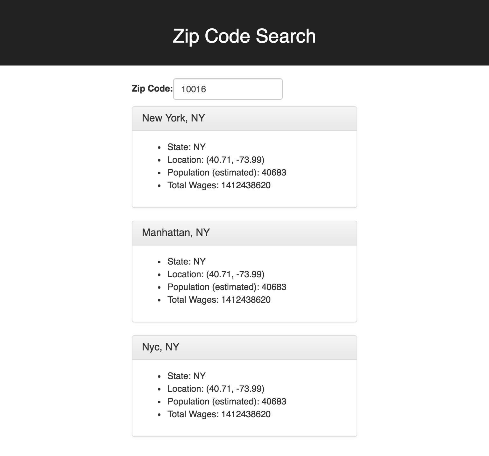

# Zip Code React Lab

In this exercise, you will create two React apps:

1. the first app allows users to search by Zip Code and retrieve information about Cities within that Zip Code.
2. the second app allows the user to search by City name and retrieve that City's related Zip Codes.

To implement these apps, you're given access to a Zip Code API that you can access from your React app. [Below is a brief description of how the API works](#the-zip-and-city-search-api-documentation-ctp-zip-api).

## Project 1: Zip Code Search app

In this project you will build a simple Zip Code search app. We will need an input field where the user can enter a zip code, like in the following image:



We will use the user input to [search the ctp-zip-api](#search-by-zip-code). If the zip code is valid the API will respond with an object for each city. Use that response to display each city in a separate div like in the following image:



### Getting started

- Fork this repo and clone your fork
- `cd zip-code-react-lab/zip-search`
- `npm install`
- `npm start`

`npm start` will launch a React dev server and should automatically open your browser. Leave the dev server running in the background and edit your code. When you save your changes you should notice your browser automatically reload to show you your new content or errors if any.

Submitting the lab:

- push the code to your forked repo
- in github you can issue a pull request back to the original repo
- message your TA with a link to your repo and pull request

## Project 2: City Search app

In this project we will allow the user to provide us a City name and we will display all of the associated zip codes to the user.

To get started run the following commands:

- Make sure you're at the root of this repo
- `npx create-react-app city-search`
- `cd city-search`
- `npm start`

At this point you should see the React hello world page running on your browser. You should leave it running in the background while you work on this project.

Now open this folder (`city-search`) in your text editor. You will see all of the code the create-react-app setup for us. Since this is the stock project we can begin editing the files as we see fit. You can start at `App.js` and you can also edit `public/index.html` (to add Bootstrap for example). You can look at the starter code for project 1 to get started.

### Tasks

Using the same ctp-zip-api we used in project 1:

- Implement a City Search field that takes city names
    + it should allow city names to be entered in upper, lower, or mixed case letters
- Display all zip codes received from the API

### Extra credit

- Display all states where the city was found in the API
- Group received zip codes by state
- Display city details for each Zip code

> Note: these will require additional fetch call to the API. Feel free to use your own CSS styles and to add any additional features you want.

## Creating a new React App

Anytime you want to create a new React application, run:

```
npx create-react-app new-react-app
```

> By using `npx` you can run the create-react-app (cra) tool without installing it globally. This is the preferred option because cra is frequently updated, and in-frequently run on our machines. By using `npx`, we ensure we build each react project with the latest version of cra.

> The `npx` tool can do a lot more, to learn more about it read: https://blog.npmjs.org/post/162869356040/introducing-npx-an-npm-package-runner


## The Zip and City search API documentation (ctp-zip-api)

**API BASE URL:** http://ctp-zip-api.herokuapp.com/

Below is a description of the relevant API endpoints:

> This API has been prebuilt for this assignment.

### Search by Zip Code

* **URL**

  `/zip/:zipcode`

* **Method**

  `GET`

* **URL Params**

  **Required:**

  `zipcode=[alphanumeric]`

* **Data Params**

  None

* **Success Response**

  * **Status Code:** 200

    **Content:**
    ```JSON
    [
        {"RecordNumber":"247","Zipcode":"10018","ZipCodeType":"STANDARD","City":"NEW YORK","State":"NY","LocationType":"PRIMARY","Lat":"40.71","Long":"-73.99","Xaxis":"0.20","Yaxis":"-0.72","Zaxis":"0.65","WorldRegion":"NA","Country":"US","LocationText":"New York, NY","Location":"NA-US-NY-NEW YORK","Decommisioned":"false","TaxReturnsFiled":"4416","EstimatedPopulation":"5928","TotalWages":"810026753","Notes":""},
        { ... },
        ...
    ]
    ```

* **Error Response**

  * **Status Code:** 404

    **Content:** `Not Found`

* **Examples**

  Provide the zipcode in the url and you will receive a JSON response with an array containing an object for each city found. For example see:

  http://ctp-zip-api.herokuapp.com/zip/10016


### Search by City Name

* **URL**

  `/city/:cityname`

* **Method**

  `GET`

* **URL Params**

  **Required:**

  `cityname=[string]`

  > String must be in all uppercase letters

* **Data Params**

  None

* **Success Response**

  * **Status Code:** 200

    **Content:**
    ```JSON
    ["05343","11405","11411","11412","11413", ...]
    ```

* **Error Response**

  * **Status Code:** 404

    **Content:** `Not Found`

* **Examples**

  Provide the city name in the url and you will receive a JSON response with an array containing all zip codes for that city:

  http://ctp-zip-api.herokuapp.com/city/SPRINGFIELD
